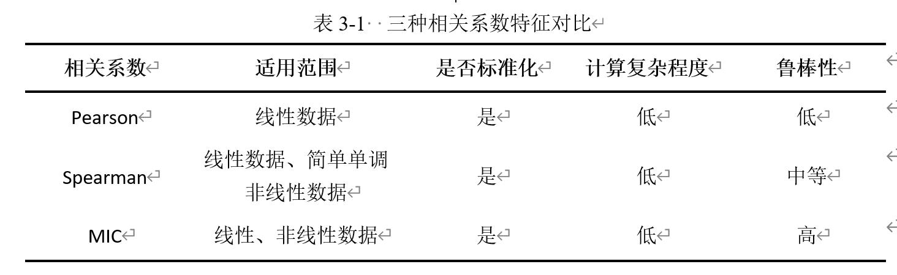

计算最大互信息系数（一种相关系数）
===========================

- 仅供学习参考，如有不足欢迎指正

****

|作者|Lilian|
|---|---
|个人主页|[Lilian's HomePage](https://Lilian-tju.github.io/)

 

 三种相关系数的比较

 

- 最大互信息系数，即MIC，是基于信息的非参数性探索。可以这么理解MIC的原理：
如果两个变量之间存在关系，那么可以在两个变量的可视化散点图上绘制一个网格，从而对数据进行分区以描述这种关系。通过这样的方式，可以很好地衡量两个变量之间的线性或者非线性，甚至是一些较为复杂的函数关系。

- MIC系数具有很突出的特点:
  - 首先就是对数据具有普适性，即使是复杂的函数叠加关系，MIC系数也可以很好的表征数据之间的相关性。
  - 其次，MIC系数还具有明显的均衡性。也就是说以MIC去衡量数据之间的关系，对于相同噪声水平的变量关系都具有相似的值。
  具有横向比对同一种相关关系的相关强度、纵向比对不同的相关关系强度的特点。只要样本足够大，MIC就可以更加准确地捕捉数据之间的关系。

**所用数据来自于酿酒酵母序列分析**

